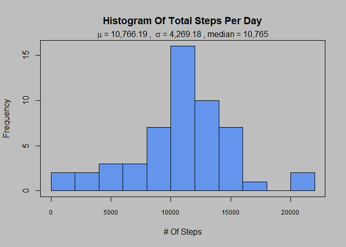
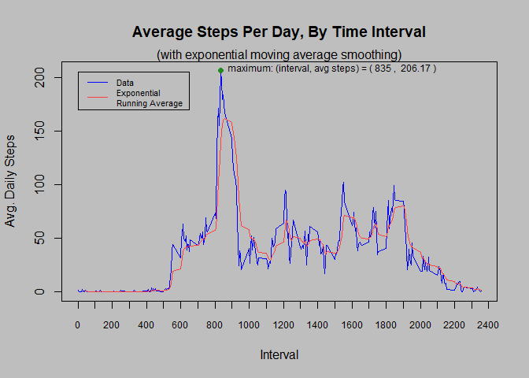
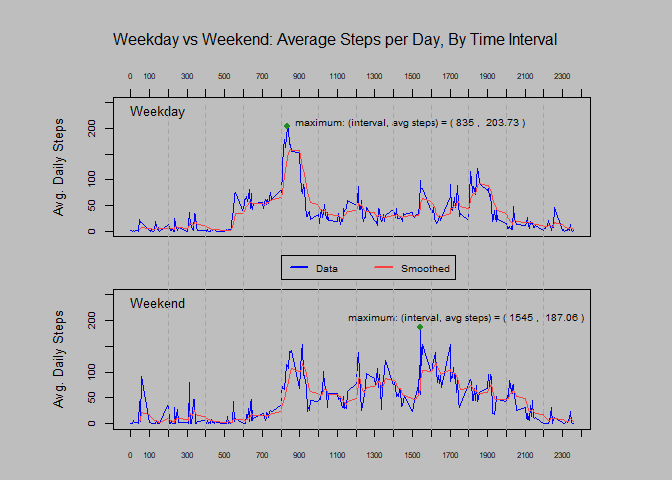

# Reproducible Research: Peer-Assessed Project 1
Christopher Jones  
10/30/2017  

## Activity Data Analysis {.tabset}

### Loading/preprocessing {.tabset}

Loading the data is simple. Light preprocessing is done, performing the following actions:

* adding a row ID column
* converting date column to actual date data type
* add a column for day of week
* create a dataset consisting of only complete observations


```r
# =======================
# Data load/preprocessing
# =======================

# download data if it isn't already in place in current directory
filename <- "activity.csv"
zipurl <- "https://d396qusza40orc.cloudfront.net/repdata%2Fdata%2Factivity.zip"

if (!file.exists(filename)) {
  download <- download.file(zipurl, destfile = "temp.zip")
  unzip("temp.zip")
  unlink("temp.zip")
}

# pre-preprocessing
data.raw <- read.csv(filename, header=TRUE)

data.proc <- data.raw
data.proc$id <- seq(1:nrow(data.proc))
data.proc$date <- as.Date(data.proc$date)
data.proc$dow <- weekdays(data.proc$date, abbreviate=TRUE)
data.proc$dow <- as.factor(data.proc$dow)
data.proc.complete <- data.proc[!is.na(data.proc$steps),]

message("Data load/preprocessing complete.")
```

```
## Data load/preprocessing complete.
```

Further processing (aggregations etc.) is performed later, specific to the requirements of each topic.


### Mean steps per day {.tabset}

Instructions:

>What is mean total number of steps taken per day?
>
>For this part of the assignment, you can ignore the missing values in the dataset.
>
>Make a histogram of the total number of steps taken each day
>
>Calculate and report the mean and median total number of steps taken per day

The required information is provided by the plot below, using the complete observations dataset, per the instructions.


```r
# =================================================
# What is mean total number of steps taken per day?
# For this part of the assignment, you can ignore the missing values in the dataset.
# Calculate the total number of steps taken per day
# If you do not understand the difference between a histogram and a barplot, research the difference between them. Make a histogram of the total number of steps taken each day
# Calculate and report the mean and median of the total number of steps taken per day
# =================================================

# set up the data
stepsperday <- aggregate(data.proc.complete$steps, by=list(data.proc.complete$date), FUN=sum)
names(stepsperday) <- c("date", "steps")

# construct the raw plot
plot.new()
par(bg = "grey")
hist(stepsperday$steps, breaks=10, main="", xaxt = "n", xlab = "# Of Steps", col = "cornflowerblue")
axis(1, at=seq(0, 25000, 5000), cex.axis =.75)
title(main="Histogram Of Total Steps Per Day")
mtext(bquote(mu 
             ~ "=" 
             ~ .(format(mean(stepsperday$steps), big.mark=","))
             ~ ", " 
             ~ sigma 
             ~ "=" 
             ~ .(format(sd(stepsperday$steps), big.mark = ","))
             ~ ", median ="
             ~ .(format(median(stepsperday$steps), big.mark = ","))
             )
      )
box()
```

<!-- -->


### Daily activity pattern {.tabeset}

Instructions:

>What is the average daily activity pattern?
>
>Make a time series plot (i.e. type = "l") of the 5-minute interval (x-axis) and the average number of steps taken, averaged across all days (y-axis)
>
>Which 5-minute interval, on average across all the days in the dataset, contains the maximum number of steps?

In addition to answering the questions given, I've provided a smoothing line. The average daily activty pattern is depicted below. On average, the maximum number of steps occurs at interval 835.


```r
# ==========================================
# What is the average daily activity pattern?
# Make a time series plot (i.e. type = "l") of the 5-minute interval (x-axis) and the average number of steps taken, averaged across all days (y-axis)
# Which 5-minute interval, on average across all the days in the dataset, contains the maximum number of steps?
# ==========================================
library(TTR) # for exponentially weighted moving average (higher weight to more recent observations)

# set up the data
avgstepsperinterval <- aggregate(data.proc.complete$steps, by=list(data.proc.complete$interval), FUN=mean)
names(avgstepsperinterval) <- c("interval", "avg_steps")
avgstepsperinterval$expMA <- EMA(avgstepsperinterval$avg_steps)

themean <- mean(avgstepsperinterval$avg_steps)
themax <- max(avgstepsperinterval$avg_steps)
themaxpre <- avgstepsperinterval$interval[avgstepsperinterval$avg_steps == themax]
thesd <- sd(avgstepsperinterval$avg_steps)

# construct the plot
windows(height = 5.5, width = 6)
plot.new()
par(bg = "grey")
plot(avgstepsperinterval$interval, avgstepsperinterval$avg_steps, type="l", col="blue", xaxt = "n", xlab="Interval", ylab="Avg. Daily Steps")
axis(1, at=seq(0, 3500, 100), cex.axis =.75)
points(x=themaxpre, y=themax, pch=19, col="forestgreen")
text(x=1.05 * themaxpre
     , y=.99 * themax
     , labels=bquote("maximum: (interval, avg steps) = (" 
                     ~ .(themaxpre)
                     ~ ", " 
                     ~ .(round(x=themax, digits=2))
                     ~ ")" 
     )
     , adj = c(0,0)
     , cex=.75)
title(main="Average Steps Per Day, By Time Interval")
mtext("(with exponential moving average smoothing)")

# add exponential moving average line for some smoothing visualization
lines(x=avgstepsperinterval$interval, y=avgstepsperinterval$expMA, type="l", col="brown1")
rect(xleft=0, xright=650, ybottom=170, ytop=205)
legend(1, 210, legend=c("Data", "Exponential\nRunning Average"), col=c("blue", "brown1"), lty=c(1, 1), cex=0.7, bty="n")
```

<!-- -->


### Missing values {.tabeset}

Instructions:

>Note that there are a number of days/intervals where there are missing values (coded as NA). The presence of missing days may introduce bias into some calculations or summaries of the data.
>
>Calculate and report the total number of missing values in the dataset (i.e. the total number of rows with NAs)
>
>Devise a strategy for filling in all of the missing values in the dataset. The strategy does not need to be sophisticated.
>
>For example, you could use the mean/median for that day, or the mean for that 5-minute interval, etc.
>
>Create a new dataset that is equal to the original dataset but with the missing data filled in.
>
>Make a histogram of the total number of steps taken each day and Calculate and report the mean and median total number of steps taken per day. Do these values differ from the estimates from the first part of the assignment? What is the impact of imputing missing data on the estimates of the total daily number of steps?


For missing values, we use the predictive mean matching method from the commonly-used mice package (2 data sets, 10 iterations).

First, md.pattern shows us what columns contain missing values:


```r
# use the standard package for imputing the missing steps values
library(lattice)
library(mice)

md.pattern(data.raw)
```

```
##       date interval steps     
## 15264    1        1     1    0
##  2304    1        1     0    1
##          0        0  2304 2304
```

Finally, we perform the imputation, and produce a before/after comparative visual:


```r
# =======================
# Imputing missing values
# Note that there are a number of days/intervals where there are missing values (coded as NA). The presence of missing days may introduce bias into some calculations or summaries of the data.
# Calculate and report the total number of missing values in the dataset (i.e. the total number of rows with NAs)
# Devise a strategy for filling in all of the missing values in the dataset. The strategy does not need to be sophisticated. For example, you could use the mean/median for that day, or the mean for that 5-minute interval, etc.
# Create a new dataset that is equal to the original dataset but with the missing data filled in.
# Make a histogram of the total number of steps taken each day and Calculate and report the mean and median total number of steps taken per day. 
# Do these values differ from the estimates from the first part of the assignment? 
# What is the impact of imputing missing data on the estimates of the total daily number of steps?
# ======================


if(!exists("data.proc.imputed")) {
  tempData <- mice(data.raw, m=2, maxit=10, meth="pmm", seed=500)
  data.proc.imputed <- complete(tempData, 1)
  data.proc.imputed$id <- seq(1:nrow(data.proc.imputed))
  data.proc.imputed$date <- as.Date(data.proc.imputed$date)
  data.proc.imputed$dow <- weekdays(data.proc.imputed$date, abbreviate=TRUE)
  data.proc.imputed$dow <- as.factor(data.proc.imputed$dow)
}
```

```
## 
##  iter imp variable
##   1   1  steps
##   1   2  steps
##   2   1  steps
##   2   2  steps
##   3   1  steps
##   3   2  steps
##   4   1  steps
##   4   2  steps
##   5   1  steps
##   5   2  steps
##   6   1  steps
##   6   2  steps
##   7   1  steps
##   7   2  steps
##   8   1  steps
##   8   2  steps
##   9   1  steps
##   9   2  steps
##   10   1  steps
##   10   2  steps
```

```r
if(nrow(data.proc.imputed) != 17568) {
  tempData <- mice(data.raw, m=2, maxit=10, meth="pmm", seed=500)
  data.proc.imputed <- complete(tempData, 1)
  data.proc.imputed$id <- seq(1:nrow(data.proc.imputed))
  data.proc.imputed$date <- as.Date(data.proc.imputed$date)
  data.proc.imputed$dow <- weekdays(data.proc.imputed$date, abbreviate=TRUE)
  data.proc.imputed$dow <- as.factor(data.proc.imputed$dow)
}


# set up the imputed data
stepsperday.imputed <- aggregate(data.proc.imputed$steps, by=list(data.proc.imputed$date), FUN=sum)
names(stepsperday.imputed) <- c("date", "steps")

# verify we've at least nominally resolved the NA problem
# > nrow(data.proc.imputed[is.na(data.proc.imputed),])
# [1] 0

# construct the raw plot
plot.new()
col.raw <- "firebrick4"
col.imputed <- "dodgerblue1"
col.imputed.alpha <- .4
myrgb <- col2rgb(col.imputed)/256 * col.imputed.alpha + col2rgb(col.raw)/256 * (1 - col.imputed.alpha)
col.mixed <- rgb(myrgb[1], myrgb[2], myrgb[3], 1)

par(bg = "grey")
hist(stepsperday$steps, ylim=c(0, 20), breaks=10, main="", xaxt = "n", xlab = "# Of Steps", col = col.raw)
rug(stepsperday$steps, side=1, col=col.raw)
axis(1, at=seq(0, 25000, 5000), cex.axis =.75)
box()

# construct imputed plot
par(bg = "grey")
hist(stepsperday.imputed$steps, ylim=c(0, 20), breaks=10, main="", xaxt = "n", xlab = "# Of Steps", col = rgb(col2rgb(col.imputed)[1]/256, col2rgb(col.imputed)[2]/256, col2rgb(col.imputed)[3]/256, col.imputed.alpha), add=TRUE)
rug(stepsperday.imputed$steps, side=3, col=col.imputed)
axis(1, at=seq(0, 25000, 5000), cex.axis =.75)
title(main="Total Steps Per Day, Raw & Imputed", line=2.5)

data1 <- "      Raw:"
data2 <- "Imputed:"
mytext1 <- list(data2, data1)
mtext(do.call(expression, mytext1), side=3, line=0:1, adj=c(.23, .23), cex=.75)

bq1 <- bquote("  " ~ mu 
              ~ "=" 
              ~ .(format(round(mean(stepsperday$steps), digits=2), big.mark=","))
              ~ " " 
              ~ sigma 
              ~ "=" 
              ~ .(format(round(sd(stepsperday$steps), digits=2), big.mark = ","))
              ~ " median ="
              ~ .(format(median(stepsperday$steps), big.mark = ","))
)

bq2 <- bquote("   " ~ mu 
              ~ "=" 
              ~ .(format(round(mean(stepsperday.imputed$steps), digits=2), big.mark=","))
              ~ " " 
              ~ sigma 
              ~ "=" 
              ~ .(format(round(sd(stepsperday.imputed$steps), digits=2), big.mark = ",", digits = 6))
              ~ "   median ="
              ~ .(format(median(stepsperday.imputed$steps), big.mark = ","))
)

mytext <- list(bq2, bq1)
mtext(do.call(expression, mytext), side=3, line=0:1, adj=c(.6, .6), cex=.75)

legend(19000, 18, legend=c("Raw", "Imputed", "Both"), col=c(col.raw, col.imputed, col.mixed), cex=0.75, pch=c(22, 22, 22), pt.bg = c(col.raw, col.imputed, col.mixed))
box()
```

<!-- -->

This plot contains 2 parts: a before/after histogram, and before/after linear density plots along the top and bottom borders. 

Overall the imputation didn't affect the character of the data very much (at least not visible in the histogram). Most of the new weight was added above the mean/median (they're close together), so the immputed mean/median ticked upwards slightly. And since most of the added weight was near the mean/median, the standard deviation shows a bit of a decrease.


### Weekdays vs Weekends {.tabset}

Instructions:

>For this part the weekdays() function may be of some help here. Use the dataset with the filled-in missing values for this part.
>	
>Create a new factor variable in the dataset with two levels -- "weekday" and "weekend" indicating whether a given date is a weekday or weekend day.
>
>Make a panel plot containing a time series plot (i.e. type = "l") of the 5-minute interval (x-axis) and the average number of steps taken, averaged across all weekday days or weekend days (y-axis).

We break out weekdays and weekends in the plots below.

While both exhibit early spikes (around intervale 800), the average weekend spike is significantly lower than the weekday spike. Additionally, activity on the weekend is much more uniformly distributed over its support than weekday activity. Finally, the weekends show much more activity in the initial 0-500 intervals than do the weekends.

We hypothesize that these characteristics indicate the difference between work days and non-work days. More exploration would be needed to support/confirm this, first perhaps being verification that the differences noted were not due merely to the addition of imputed values.


```r
# ======================
# Are there differences in activity patterns between weekdays and weekends?
# For this part the weekdays() function may be of some help here. Use the dataset with the filled-in missing values for this part.
# Create a new factor variable in the dataset with two levels – “weekday” and “weekend” indicating whether a given date is a weekday or weekend day.
# Make a panel plot containing a time series plot (i.e. type = "l") of the 5-minute interval (x-axis) and the average number of steps taken, averaged across all weekday days or weekend days (y-axis). See the README file in the GitHub repository to see an example of what this plot should look like using simulated data.
# ======================

library(TTR) # for exponentially weighted moving average (higher weight to more recent observations)

# set up the data
weekdays <- c("Mon", "Tue", "Wed", "Thu", "Fri")
weekends <- c("Sat", "Sun")

# Weekdays data aggregation
avgstepsperinterval.wkdys <- aggregate(data.proc.imputed[data.proc.imputed$dow %in% weekdays,]$steps, by=list(data.proc.imputed[data.proc.imputed$dow %in% weekdays,]$interval), FUN=mean)
names(avgstepsperinterval.wkdys) <- c("interval", "avg_steps")
avgstepsperinterval.wkdys$expMA <- EMA(avgstepsperinterval.wkdys$avg_steps)

themean.wkdys <- mean(avgstepsperinterval.wkdys$avg_steps)
themax.wkdys <- max(avgstepsperinterval.wkdys$avg_steps)
themaxpre.wkdys <- avgstepsperinterval.wkdys$interval[avgstepsperinterval.wkdys$avg_steps == themax.wkdys]
thesd.wkdys <- sd(avgstepsperinterval.wkdys$avg_steps)

# Weekends data aggregation
avgstepsperinterval.wkends <- aggregate(data.proc.imputed[data.proc.imputed$dow %in% weekends,]$steps, by=list(data.proc.imputed[data.proc.imputed$dow %in% weekends,]$interval), FUN=mean)
names(avgstepsperinterval.wkends) <- c("interval", "avg_steps")
avgstepsperinterval.wkends$expMA <- EMA(avgstepsperinterval.wkends$avg_steps)

themean.wkends <- mean(avgstepsperinterval.wkends$avg_steps)
themax.wkends <- max(avgstepsperinterval.wkends$avg_steps)
themaxpre.wkends <- avgstepsperinterval.wkends$interval[avgstepsperinterval.wkends$avg_steps == themax.wkends]
thesd.wkends <- sd(avgstepsperinterval.wkends$avg_steps)

# construct the plots
plot.new()
layout(matrix(c(1,2), 2, 2, byrow=FALSE), widths=c(1,1), heights=c(4,4))
par(bg = "grey")
par(oma=c(3,3,3,3))  # all sides have 3 lines of space  
par(mar=c(.1,4,3,2) + 0.1)  

# Weekdays
plot(avgstepsperinterval.wkdys$interval, avgstepsperinterval.wkdys$avg_steps, type="l", ylim=c(0, 250), col="blue", yaxt="n", xaxt = "n", xlab="", ylab="Avg. Daily Steps")
axis(3, at=seq(0, 2400, 100), cex.axis =.60)
axis(2, at=seq(0, 250, 50), cex.axis =.75)
points(x=themaxpre.wkdys, y=themax.wkdys, pch=19, col="forestgreen")
text(x=1.05 * themaxpre.wkdys
     , y=.99 * themax.wkdys
     , labels=bquote("maximum: (interval, avg steps) = (" 
                     ~ .(themaxpre.wkdys)
                     ~ ", " 
                     ~ .(round(x=themax.wkdys, digits=2))
                     ~ ")" 
     )
     , adj = c(0,0)
     , cex=.75)
text(x=0, y=225, labels="Weekday", cex=1, adj=c(0,0))
y.tmp <- grconvertY(250, to='ndc')

# add exponential moving average line for some smoothing visualization
lines(x=avgstepsperinterval.wkdys$interval, y=avgstepsperinterval.wkdys$expMA, type="l", col="brown1")


# Weekends
plot(avgstepsperinterval.wkends$interval, avgstepsperinterval.wkends$avg_steps, type="l", ylim=c(0, 250), col="blue", yaxt="n", xaxt = "n", xlab="Interval", ylab="Avg. Daily Steps")
axis(1, at=seq(0, 2400, 100), cex.axis =.60)
axis(2, at=seq(0, 250, 50), cex.axis =.75)
points(x=themaxpre.wkends, y=themax.wkends, pch=19, col="forestgreen")
text(x=.75 * themaxpre.wkends
     , y=1.05 * themax.wkends
     , labels=bquote("maximum: (interval, avg steps) = (" 
                     ~ .(themaxpre.wkends)
                     ~ ", " 
                     ~ .(round(x=themax.wkends, digits=2))
                     ~ ")" 
     )
     , adj = c(0,0)
     , cex=.75)
text(x=0, y=225, labels="Weekend", cex=1, adj=c(0,0))

# add exponential moving average line for some smoothing visualization
lines(x=avgstepsperinterval.wkends$interval, y=avgstepsperinterval.wkends$expMA, type="l", col="brown1")

# sync lines between plots
par(xpd=NA)
numlines <- 11
plotwidth <- 2400
segments(seq(from = plotwidth/(numlines+1)
             , to = plotwidth-(plotwidth/(numlines+1))
             , by = plotwidth/(numlines+1))
         , rep(-10, 4)
         , seq(from = plotwidth/(numlines+1)
               , to = plotwidth-(plotwidth/(numlines+1))
               , by = plotwidth/(numlines+1))
         , rep(1.0*grconvertY(y.tmp, from='ndc'), 4)
         , lty='dashed'
         , col='gray65')

# legend
par(xpd=TRUE)
legend(800, 325
       , legend = c("Data", "Smoothed")
       , col = c("blue", "brown1")
       , lwd = 2
       , cex = .75
       , horiz = TRUE
)
par(xpd=NA)

# title
mtext("Weekday vs Weekend: Average Steps per Day, By Time Interval", outer=TRUE, cex=1)
```

<!-- -->

fin
